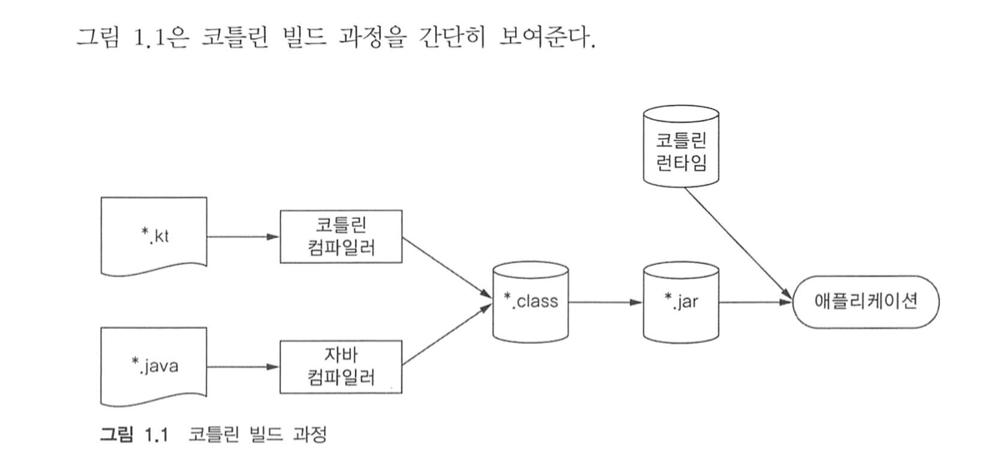

## 코틀린이란 무엇이며, 왜 필요한가?

### 1.1 코틀린 맛보기
### 1.2 코틀린의 특성
#### 1.2.1 대상 플랫폼: 서버 안드로이드 등 자바가 실행되는 모든 곳
#### 1.2.2 정적 타입 지정 언어
* 자바와 마찬가지로 코틀린도 정적 타입(statically typed) 지정 언어
> 정적 타입 지정 
> > 모든 프로그램 구성 요소의 타입을 컴파일 시점에 알 수 있고 프로그램 안에서 객체의 필드나 메소드를 사용할 때 마다 컴파일러가 타입을 검증해 준다는 뜻

* 한편 자바와 달리 코틀린에서는 모든 변수의 타입을 프로그래머가 직접 명시할 필요가 없다.
```kotlin
var x = 1
```
* 여기서는 변수를 정의하면서 정수 값으로 초기화한다. 코틀린은 이 변수 타입이 Int 임을 자동으로 알아낸다.
* 컴파일러가 문맥을 고려해 변수 타입을 결정하는 이런 기능을 **타입추론** 이라고 부른다.
* 코틀린이 널이 될 수 있는 타입을 지원한다. 따라서, 컴파일 시점에 NPE 여부를 검사할 수 있다.

#### 1.2.3 함수형 프로그래밍과 객체지향 프로그래밍
* 코틀린은 처음부터 함수형 프로그래밍을 풍부하게 지원해 왔다.
* 함수형 프로그래밍의 핵심 개념은 다음과 같다.
> 일급 시민인 함수
> > 함수를 일반 값처럼 다룰 수 있다. 변수 저장, 다른 함수에 전달등의 가능하다.

> 불변성
> > 내부 상태가 절대로 바뀌지 않는 불변 객체를 사용해 프로그램을 작성한다.

> 부수효과 없음
> > 함수형 프로그래밍에서는 입력이 같으면 항상 같은 출력을 내놓고 다른 객체의 상태를 변경하지 않는다.


* 이로 인한 이점은 다음과 같다.

> 간결하다.
> > 함수를 값처럼 활용하면 더 강력한 추상화가 가능하다. 따라서 코드 중복을 막을 수 있다.

> 다중 스레드를 사용해도 안정하다.
> > 불변 데이터 구조 사용이 가능하다.

> 테스트하기 쉽다.
> > 부수 효과가 있는 함수는 그 함수를 실행할 때 필요한 전체 환경을 구성하는 준비 코드(setup code) 가 따로 필요하지만 순수 함수는 그런 코드가 필요 없다.

#### 1.2.4 무료 오픈소스

### 1.3 코틀린 응용
#### 1.3.1 코틀린 서버 프로그래밍
#### 1.3.2 코틀린 안드로이드 프로그래밍
* 코틀린 타입 시스템은 null 값을 정확히 추적한다. 자바에서 NPE 을 일으키는 유형의 코드가 코틀린에서는 컴파일도 되지 않는다.
* 코틀린을 사용하더라도 성능 측면에서는 아무 손해가 없다. 또한 코틀린 표준 라이브러리 함수는 인자로 받은 람다 함수를 인라이닝(inlining) 한다. 따라서, 
람다를 사용해도 객체 증가로 인한 GC 가 늘어날 일은 없다.
  
### 1.4 코틀린의 철학
#### 1.4.1 실용성
#### 1.4.2 간결성
* 개발자가 코드를 새로 작성하는 시간보다 기존 코드를 읽는 시간이 더 길다.
* 코틀린은 프로그래머가 작성하는 코드에서 의미가 없는 부분을 줄였다.
* 예를 들어, getter, setter, 생성자 파라미터를 필드에 대입하기 위한 로직을 묵시적으로 제공한다.
* 따라서 코드가 간결하여 코드를 쓰고 작성하는 데 시간이 덜 걸린다.
#### 1.4.3 안전성
* 일반적으로 프로그래밍 언어가 안전하다는 말은 프로그램에서 발생할 수 있는 오류 중에 일부 유형을 프로그램 설계가 방지해 준다는 뜻이다.
* 코틀린의 타입 시스템은 null 이 될 수 없는 값을 추적하며, 실행 시점에 NPE 로 발생할 수 있는 연산을 사용하는 코드를 금지한다.
#### 1.4.4 상호 운용성
* 자바 라이브러리가 어떤 API 를 제공하던 간에 코틀린에서 사용할 수 있다.
* 자바 클래스를 상속, 확장 하거나 인터페이스를 구현하거나 자바 애노테이션을 코틀린 코드에 적용하는 등의 일이 모두 가능하다.
### 1.5 코틀린 도구 사용
#### 1.5.1 코틀린 코드 컴파일
* 코틀린 컴파일러는 자바컴파일러가 자바 소스코드를 컴파일할 때와 마찬가지로 코틀린 소스코드를 분석해서 .class 파일을 만들어 낸다.
* 코틀린으로 컴파일한 애플리케이션을 배포할 때는 런타임 라이브러리도 함께 배포해야한다.

#### 1.5.2 인텔리J 아이디어와 안드로이드 스튜디오의 코틀린 플러그인
#### 1.5.3 대화형 셀
#### 1.5.4 이클립스 플러그인
#### 1.5.5 온라인 놀이터
#### 1.5.6 자바-코틀린 변환기
### 1.6 요약