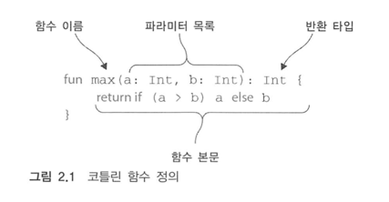
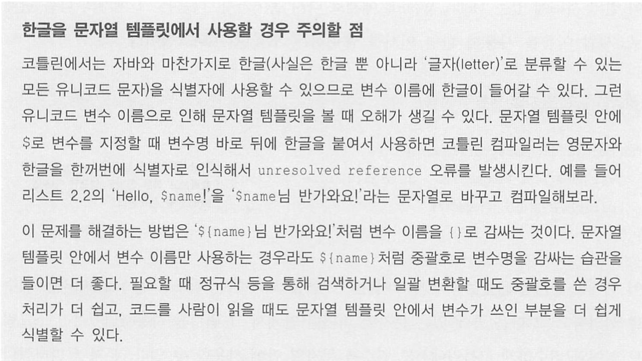
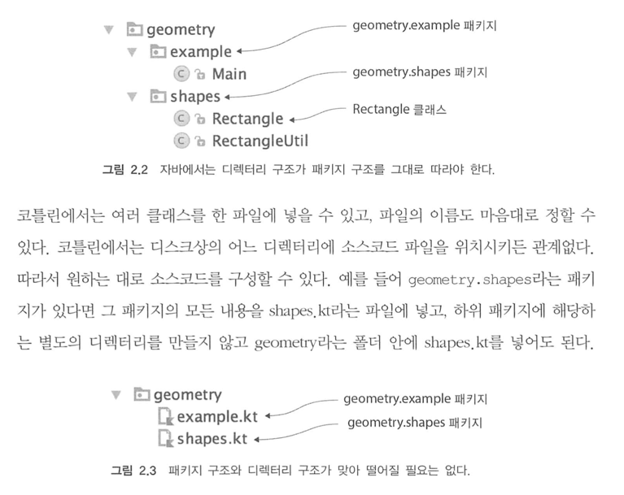
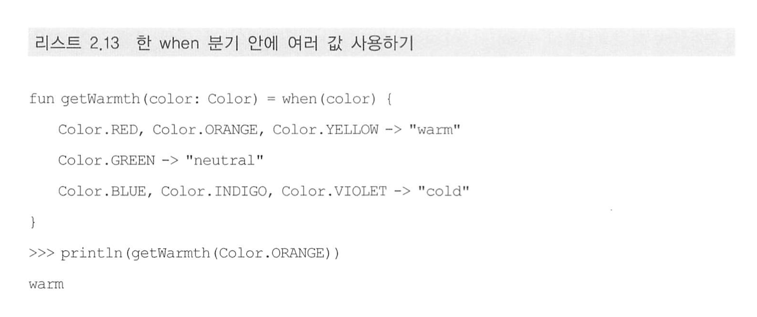
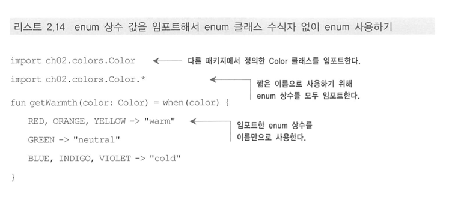
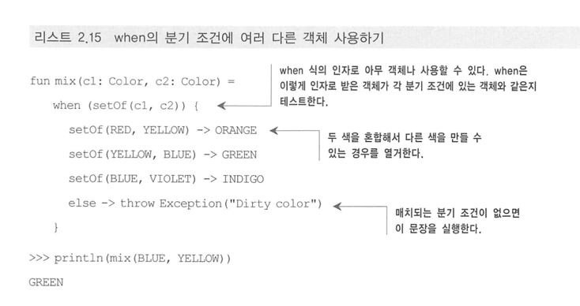
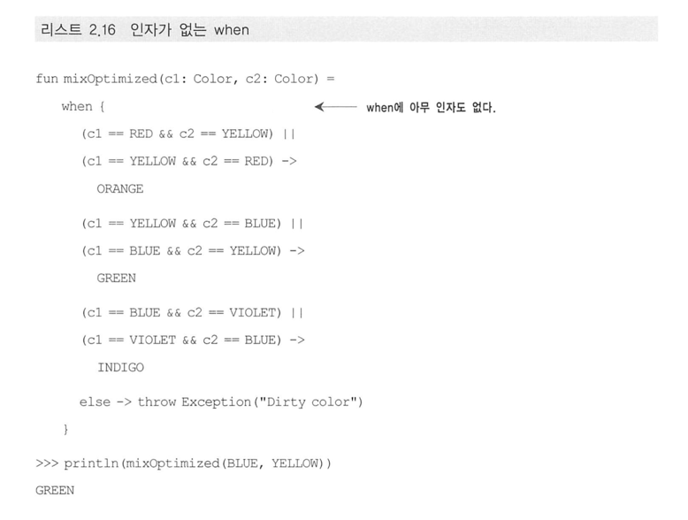
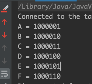
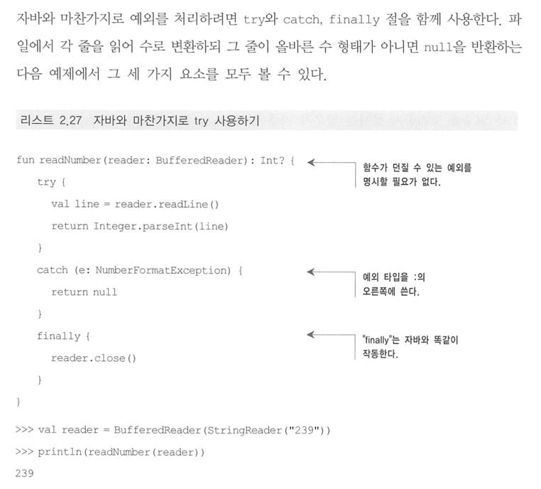
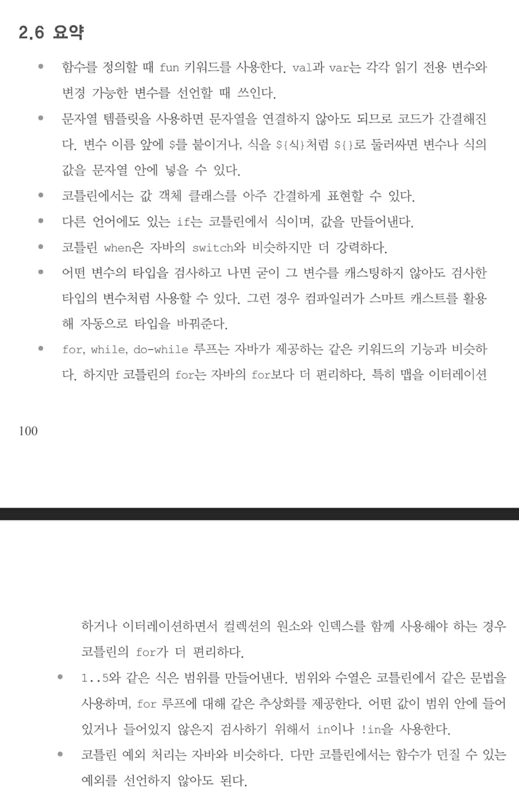

# 코틀린 기초

## 2.1 기본 요소: 함수와 변수

- 목표
    - 코틀린에서 타입 선언을 생략해도 된다는 사실을 보고, 코틀린이 어떻게 변경 가능한 데이터보다 변경할 수 없는 불변데이터 사용을 장려하는지 배운다.

### 2.1.1 Hello, World

- 아무것도 반환하지 않은 함수

```kotlin
fun main(args: Array<String>) {
    println("Hello, world!")
}
```

### 2.1.2 함수

```kotlin
fun max(a: Int, b: Int): Int {
    return if (a > b) a else b
}
println(max(1, 2))
```

- 함수 선언은 fun 키워드로 시작한다.
- fun 다음에는 함수 이름이 온다.
- 함수의 반환 타입은 파라미터 목록의 닫는 괄호 다음에 오는데, 괄호와 반환타입 사이를 콜론(:) 으로 구분해야한다



### 식이 본문인 함수

- 본문이 **중괄호**로 둘러싸인 함수를 블록이 본문인 함수
- **등호와 식**으로 이뤄진 함수를 식이 본문인 함수

### 문

```kotlin
fun max(a: Int, b: Int): Int {
    return if (a > b) a else b
}
Println(max(1, 2))
```

### 식

```kotlin
fun max(a: Int, b: Int): Int = if (a > b) aelseb
```

- 인텔리J 아이디어 팁
    - 인텔리J 에서는 이 두 방식의 함수를 서로 변환하는 메뉴가 있다.
    - 각각은 '식 본문으로 변환 (Convert to expression body)'과 '블록 본문으로 변환(Convert to block body)'이다.

### 2.1.3 변수

- 코틀린에서는 타입 지정을 생략하는 경우가 흔하다.
- **타입으로 변수 선언을 시작하면 타입을 생략할 경우 식과 변수 선언을 구별할 수 없다.**
- 그런 이유로 코틀린에서는 키워드로 변수 선언을 시작하는 대신 변수 이름뒤에 타입을 명시하거나 생략하게 허용 한다.

```kotlin
var question = "삶, 우주"
var answer = 42
var answer: Int = 42
```

- 초기화 식을 사용하지 않고 변수를 선언하려면 변수 타입을 반드시 명시해야한다.

### 변경 가능한 변수와 변경 불가능한 변수

- val(값을 뜻하는 value에서 따옴) - 변경 불가능한 참조를 저장하는 변수다. val로 선언된 변수는 일단 초기화하고 나면 **재대입**이 불가능하다. 자바로 말하면 **
  final** 변수에 해당한다
- var(변수를 뜻하는 variable에서 따옴) - 변경 가능한 참조다. 이런 변수의 값은 바뀔 수 있다. 자바의 일반 변수에 해당한다.
- 기본적으로 모든 변수를 val 키워드로 사용해 불변 변수로 선언하고, 나중에 꼭 필요할 때에만 var로 변경하라.

---

- val 변수는 블록을 실핼할 때 정확히 한 번만 초기화돼야 한다. 하지만 어떤 블록이 실행될 때 오직 한 초기화 문장만 실행됨을 컴파일러가 확인할 수 있다면 조건에 따라 val
  값을 다른 여러 값으로 초기화할 수도 있다

```kotlin
val message: String
if (canPerformOperation()) {
    message = "Success"
    // ... 연산을 수행한다.
} else {
    message = "Failed"
}
```

- val 참조 자체는 불변일지라도 **그 참조가 가리키는 객체의 내부 값**은 변경될 수 있다는 사실을 기억하라.

```kotlin
val languages = arrayListOf("Java") // 불변 참조를 선언한다
languages.add("Kotlin") // 참조가 가리키는 객체 내부를 변경한다.
```

- 어떤 타입의 변수에 다른 타입의 값을 저장하고 싶다면 **변환 함수**를 써서 값을 변수의 타입으로 변환하거나, 값을 변수에 대입할 수 있는 타입으로 강제 형 변환 해야한다.

### 2.1.4 더 쉽게 문자열 형식 지정: 문자열 템플릿

```kotlin
fun main(args: Array<String>) {
    val name = if (args.size > 0) args[0] lese "Kotlin"
    pritinln("Hello, $name!") // 변수를 문자열 안에 넣었다 자바 -> "Hello," +name+ "!"

}
```

- 문자열 템플릿 안에 사용할 수 있는 대상은 간단한 변수 이름만으로 한정되지 않는다.
- 복잡한 식도 중괄호({}) 로 둘러싸서 문자열 템플릿 안에 넣을 수 있다.

```kotlin
fun main(args: Array<String>) {
    if (args.size > 0) {
        println("Hello, ${args[0]}!")
    }
}
```



- 문자열 템플릿 안에 $ 로 변수를 지정할 때 변수명 바로 뒤에 한글을 붙여서 사용하면 코틀린 컴파일러는 영문자와 한글을 한꺼번에 식별자로 인식해서 unresolved
  reference 오류를 발생시킨다.
- 해결방법
    - '${name}님 반가와요!' 처럼 변수 이름을 {}로 감싸는 것이다.

## 2.2 클래스와 프로퍼티

- 클래스를 선언하는 기본 문법을 소개한다.

```java
public class Person {
  private final String name;

  public Person(String name) {
    this.name = name;
  }

  public String getName() {
    return name;
  }
}
```

- 필드가 둘 이상으로 늘어나면 생성자인 Person(String name) 의 본문에서 파라미터를 이름이 같은 필드에 대입하는 대입문의 수도 늘어난다.

- 코틀린으로 변환한 Person 클래스

```kotlin
class Person(val name: String)
```

- 코드가 없이 데이터만 저장하는 클래스를 **값 객체** 라 부르며, 다양한 언어가 값 객체를 간결하게 기술할 수 있는 구문을 제공한다.
- 자바를 코틀린으로 변환한 결과, public 가시성 변경자가 사라졌음을 확인하라
- 코틀린의 기본 가시성은 public 이므로 이런 경우 변경자를 생략해도 된다.

### 2.1.1 프로퍼티

- 클래스라는 개념의 목적은 데이터를 캡슐화 하고 캡슐화한 데이터를 다루는 코드를 한 주체 아래 가두는 것이다.
- 자바에서는 필드와 접근자를 한데 묶어 **프로퍼티**라고 부르며, 프로퍼티라는 개념을 활용한 프레임워크가 많다.

```kotlin
// 리스트 2.5 클래스 안에서 변경 가능한 프로퍼티 선언하기
class Person(
    val name: String,
    var isMarried: Boolean
)
```

- 사용하는 쪽의 코드는 완전히 똑같다.
- 자바에서는 person.setMarried(false) 코틀린에서는 person.isMarried =false 를 쓴다.

### 2.2.2 커스텀 접근자

- 프로퍼티의 접근자를 직접 작성하는 방법을 보여준다

```kotlin
class Rectangle(val height: Int, val width: Int) {
    val isSquare: Boolean
        get() {  // 프로퍼티 게터 선언
            return height == width
        }
}
```

- isSquare 프로퍼티에는 자체 구현을 제공하는 게터만 존재한다.

### 2.2.3 코틀린 소스코드 구조: 디렉터리와 패키지

- 모든 코틀린 파일의 맨 앞에 package문을 넣을 수 있다.
- 그러면 그 파일안에 있는 모든 선언(클래스, 함수, 프로퍼티 등) 이 해당 패키지에 들어간다.
- 같은 패키지에 속해 있다면 다른 파일에서 정의한 선언일지라도 직접 사용할 수 있다.
- 반면 다른 패키지에 정의한 선언을 사용하려면 임포트를 통해 선언을 불러와야 한다.
- 자바와 마찬가지로 임포트문은 파일의 맨 앞에 와야 하며 **import**키워드를 사용한다.

```kotlin
// 리스트 2.9 다른 패키지에 있는 함수 임포트하기
package geometry.example

import geometry.shapes.createRandomRectagle // 이름으로 함수 임포트하기

fun main(args: Array<String>) {
    println(createRandomRectangle().isSquare)
}
```

- 코틀린에서는 여러 클래스를 한 파일에 넣을 수 있고, 파일의 이름도 마음대로 정할 수 있다.
- 코틀린에서는 디스크상의 어느디렉터리에 소스코드 파일을 위치시키든 관계없다.
  
- **하지만 대부분의 경우 자바와 같이 패키지별로 디렉터리를 구성하는 편이 낫다.**
- 자바의 방식을 따르지 않으면 자바 클래스를 코틀린 클래스로 마이그레이션할 때 문제가 생길 수도 있다.
- **하지만 여러 클래스를 한 파일에 넣는 것을 주저해서는 안 된다.**
- 특히 각 클래스를 정의하는 소스코드 크기가 아주 작은 경우 더욱 그렇다.

## 2.3 선택 표현과 처리: enum 과 when

- 목표
    - when에 대해 설명하는 과정에서 코틀린에서 enum을 선언하는 방법과 스마트 캐스트에 대해서도 살펴본다.

### 2.3.1 enum 클래스 정의

```kotlin
enum class Color {
    RED, ORANGE, YELLOW, GREEN, BLUE, INDIGO, VIOLET
}
```

- 코틀린에서는 enum class 를 사용하지만 자바에서는 enum을 사용한다.
- 코틀린에서 enum은 **소프트 키워드**라 부르는 존재다.
- 반면 class 는 키워드다.
- 따라서 class라는 이름을 사용할 수 없으므로 클래스를 표현하는 변수 등을 정의할 때는 clazz나 aClass와 같은 이름을 사용해야 한다.

```kotlin
// 리스트 2.11 프로퍼티와 메소드가 있는 enum 클래스 선언하기
enum class Color(
    var r: Int, val g: Int, val b: Int
) {
    RED(255, 0, 0), ORANGE(255, 165, 0);    // 여기 반드시 세미콜론을 사용해야한다.

    fun rgb() = (r * 256 + g) * 256 + b // enum 클래스 안에서 메소드를 정의한다.
}
>>> println(Color.RED.rgb())
```

### 2.3.2 when 으로 enum 클래스 다루기

```kotlin
// 리스트 2.12 when을 사용해 올바른 enum 값 찾기
fun getMnemonic(color: Color) =
    when (color) {  // 색이 특정 enum 상수와 같을 때 그 상수에 대응하는 문자열을 돌려준다.
        Color.RED -> "Richard"
        Color.ORANGE -> "Of"
        Color.YELLOW -> "York"
            ...
    }
```

- 앞의 코드는 color 로 전달된 값과 같은 분기를 찾는다.
- 자바와 달리 각 분기의 끝에 break를 넣지 않아도 된다.
    - 자바에서는 break 를 빼먹어서 오류가 생기는 경우가 자주 있다.
- 성공적으로 매치되는 분기를 찾으면 switch는 그 분기를 실행한다.
- 한 분기 안에서 여러 값을 매치 패턴으로 사용할 수도 있다. 그럴 경우 콤마(,)로 분리한다
  



### 2.3.3 when 과 임의의 객체를 함께 사용

- 코틀린 when의 분기 조건은 임의의 객체를 허용한다.
  

### 2.3.4 인자 없는 when 사용

- 인자가 없는 when 식을 사용하면 불필요한 객체 생성을 막을 수 있다.
- 코드는 약간 읽기 어려워지지만 성능을 더 향상시키기 위해 그 정ㄷ ㅗ비용을 감수해야 하는 경우도 자주 있다.
  

### 2.3.5 스마트 캐스트: 타입 검사와 타입 캐스트를 조합

- 코틀린에서는 is를 사용해 변수 타입을 검사한다.
- is 검사는 자바의 instanceof와 비슷하다.
- 자바에서는 어떤 변수의 타입을 instanceof로 확인한 다음에 그 타입에 속한 멤버에 접근하기 위해서는 명시적으로 변수 타입을 캐스팅해야 한다.
- 이런 멤버 접근을 여러번 수행해야 한다면 변수에 따로 캐스팅한 결과를 저장한 후에 사용해야한다.
- 코틀린에서는 프로그래머 대신 컴파일러가 캐스팅을 해준다.
- 어떤 변수가 원하는 타입인지 일단 is로 검사하고 나면 굳이 변수를 원하는 타입으로 캐스팅하지 않아도 마치 처음부터 그 변수가 원하는 타입으로 선언된 것처럼 사용할 수 있다.
  하지만 실제로는 컴파일러가 캐스팅을 수행해준다. 이를 **스마트 캐스트**라고부른다.
- **스마트 캐스트는 is로 변수에 든 값의 타입을 검사한 다음에 그 값이 바뀔 수 없는 경우에만 작동한다**
- 프로퍼티는 반드시 val이어야 하며 커스텀 접근자를 사용한 것이어도 안된다.
    - val 이 아니거나 val 이지만 커스텀 접근자를 사용하는 경우에는 해당 프로퍼티에 대한 접근이 항상 같은 값을 내놓는다고 확신할 수 없기 때문이다.
- 원하는 타입으로 명시적으로 타입 캐스팅하려면 as 키워드를 사용한다

```kotlin
val n = e as Num
```

### 2.3.6 리팩토링: if를 when으로 변경

- 코틀린에서는 if 가 값을 만들어 내기 때문에 자바와 달리 3항 연산자가 따로 없다.
- 이런 특성을 사용하면 eval 함수에서 return 문과 중괄호를 없애고 if 식을 본문으로 사용해 더 간단하게 만들 수 있다.

```kotlin
fun eval(e: Expre): Int =
    if (e is Num) {
        e.value
    } else if (e is Sum) {
        eval(e.right) + eval(e.left)
    } else {
        throw IllegalArgumentException("Unknown expression")
    }
println(eval(Sum(Num(1), Num(2))))
```

- if의 분기에 식이 하나밖에 없다면 중괄호를 생략해도 된다.
- if 분기에 블록을 사용하는 경우 그 블록의 마지막 식이 그 분기의 결과 값이다.

```kotlin
fun eval(e: Expre): Int =
    when (e) {
        is Num ->
            e
        is Sum ->
            eval(e.right) + eval(e.left)
        else ->
            throw IllegalArgumentException("Unknown expression")
    }
```

- when 과 if 식을 사용한 eval 을 서로 비교해보고, when 으로 if 를 대신할 수 있는 경우가 언제인지 생각해보라.
- if나 when 의 각 분기에서 수행해야 하는 로직이 복잡해지면 분기 본문에 블록을 사용할 수 있다.

### 2.3.7 if와 when 의 분기에서 블록 사용

- '블록의 마지막 식이 블록의 결과'라는 규칙은 블록이 값을 만들어내야 하는 경우 항상 성립한다.
- 이 규칙은 함수에 대해서는 성립하지 않는다. 식이 본문인 함수는 블록을 본문으로 가질 수 없고 블록이 본문인 함수는 내부에 return 문이 반드시 있어야 한다.

## 2.4 대상을 이터레이션: while 과 for 루프

- 코틀린 while루프는 자바와 동일
- for는 자바의 for-each루프에 해당하는 형태만 존재한다.
- for는 C#과 마찬가지로 for <아이템> in <원소들> 형태를 취한다.

### 2.4.1 while 루프

### 2.4.2 수에 대한 이터레이션: 범위와 수열

- 코틀린에는 자바의 for루프가 없다

```java
// 아래 for 문법이 없다
class Temp {
  public static void main(String[] args) {
    for (int i = 0; i <= 100; i++) {
      System.out.println(i);
    }
  }
}
```
- 코틀린은 초깃값, 증가 값, 최종값을 사용한 루프를 대신하기 위해 범위(range)를 사용한다
- 범위는 기본적으로 두 값을 이뤄진 구간이다.
- 보통은 그 두 값은 정수 등의 숫자 타입의 값이며, .. 연산자로 시작 값과 끝 값을 연결해서 범위를 만든다.
```kotlin
val ontToTen = 1..10
```
- 코틀린의 범위는 양끝을 포함하는 구간이다.
- 이는 두 번째 값이 항상 범위에 포함된다는 뜻이다.

```kotlin
// when 을 사용해 피즈버즈 게임 구현하기
fun fizzBuzz(i: Int) = when {
    i % 15 == 0 -> "FizzBuzz"
    i % 3 == 0 -> "Fizz"
    i % 5 == 0 -> "Buizz"
    else -> "$i"
}
>>> for (i in 1..100) {
    print(fizzBuzz(i))
}

// 증가 값을 갖고 범위 이터레이션하기
for (i in 100 downTo 1 step 2){
    println(fizzBuzz(i))
}
```
- 증가 값 step 을 갖는 수열에 대해 이터레이션 한다.
- 증가 값을 사용하면 수를 건너 뛸 수 있다.
- 증가 값을 음수로 만들면 정방향 수열이 아닌 역방향 수열을 만들 수 있다.
- 이 예제에서 100 downTo 1은 역방향 수열을 만든다
  - 역방향 수열의 기본 증가 값은 -1이다.
  - 그 뒤에 step 2를 붙이면 증가 값의 절댓값이 2로 바뀐다
- 끝 값을 포함하지 않는 반만 닫힌 범위 에 대해 이터레이션하면 편할 때가 자주 있다.
- 그런 범위를 만들고 싶다면 until 함수를 사용하라 
  - for (x in 0 until size)라는 루프는 for(x in 0..size-1)과 같지만 좀더 명확하게 개념을 표현한다

### 2.4.3 맵에 대한 이터레이션
```kotlin
// 맵을 초기화 하고 이터레이션 하기
val binaryReps = TreeMap<Char, String>()
for (c in 'A'..'F'){
    val binary = Integer.toBinaryString(c.toInt())
  binaryReps[c] = binary
}
for((letter, binary) in binaryReps){
    println("$letter = $binary")
}
```


### 2.4.4 in으로 컬렉션이나 범위의 원소 검사 
- !in 을 사용하면 어떤 값이 범위에 속하지 않는지 검사할 수 있다.
- in과 !in 연산자를 when 식에서 사용해도 된다.
- 범위는 문자에만 국한되지 않는다.
- 비교가 가능한 클래스라면(java.lang.Compareable 인터페이스를 구현한 클래스라면) 그 클래스의 인스턴스 객체를 사용해 범위를 만들 수 있다.


## 2.5 코틀린의 예외 처리
- 코틀린의 기본 예외 처리 구문은 자바와 비슷하다
```kotlin
if(percentage !in 0..100){
    throw IllegalArgumentException("'A percentage value must be between 0 and 100: $spercentage")
}
```
- 자바와 달리 코틀린의 throw는 식이므로 다른 식에 포함될 수 있다.

### 2.5.1 try, catch, finally


- 자바 코드와 가장 큰 차이는 throws(이 경우 s가 붙어있다) 절이 코드에 없다는 점이다.
- 다른 최신 JVM 언어와 마찬가지로 코틀린도 체크 예외와 언체크 예외를 구별하지 않는다.
- 코틀린에서는 함수가 던지는 예외를 지정하지 않고 발생한 예외를 잡아내도 되고 잡아내지 않아도 된다.
- 자바는 체크 예외 처리를 강제한다. 하지만 프로그래머들이 의미 없이 예외를 다시 던지거나, 예외를 잡되 처리하지는 않고 그냥 무시하는 코드를 작성하는 경우가 흔하다. 그로인해 예외 처리 규칙이 실제로는 오류 발생을 방지하지 못하는 경우가 자주 있다.

### 2.5.2 try를 식으로 사용
```kotlin
fun readNumber(reader: BufferedReader){
    val number = try {
        Integer.parseInt(reader.readLine())
    } catch (e: NumberFormatException) {
        return
    }
  println(number)
}
val reader = BufferedReader(StringReader("not a number"))
readNumber(reader)
```
- 코틀린의 try 키워드는 if나 when과 마찬가지로 식이다.
- 따라서 try 의 값을 변수에 대입할 수 있다.
- if 와 달리 try의 본문에 반드시 중괄호 {} 로 둘러싸야 한다.
- 다른 문장과 마찬가지로 try의 본문도 내부에 여러 문장이 있으면 마지막 식의 값에 전체 결과 값이다.
- 


## 2.6 요약



