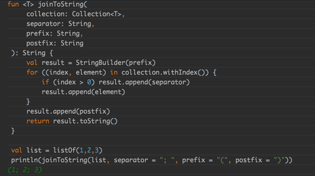
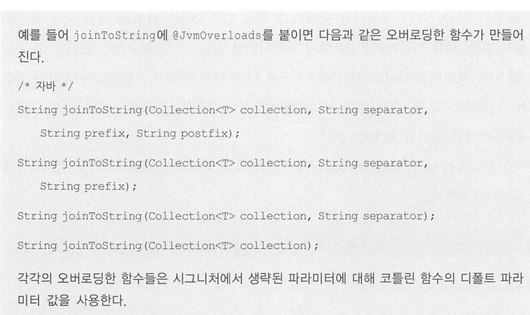
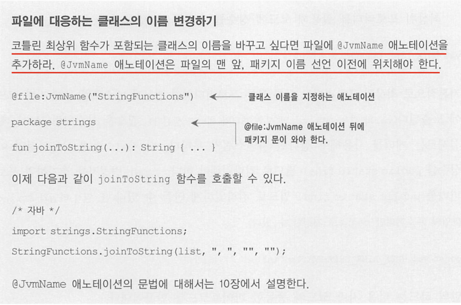
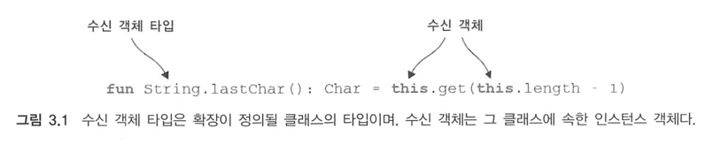
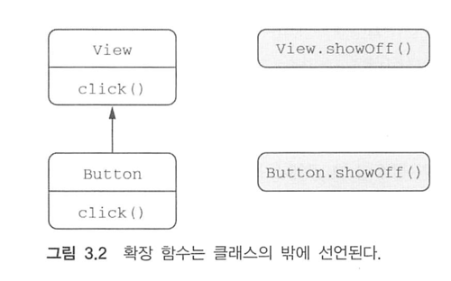
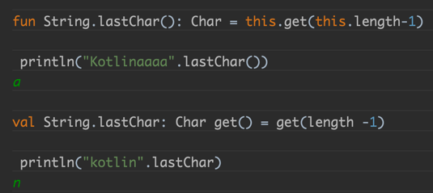
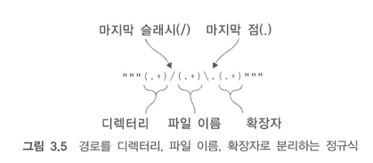
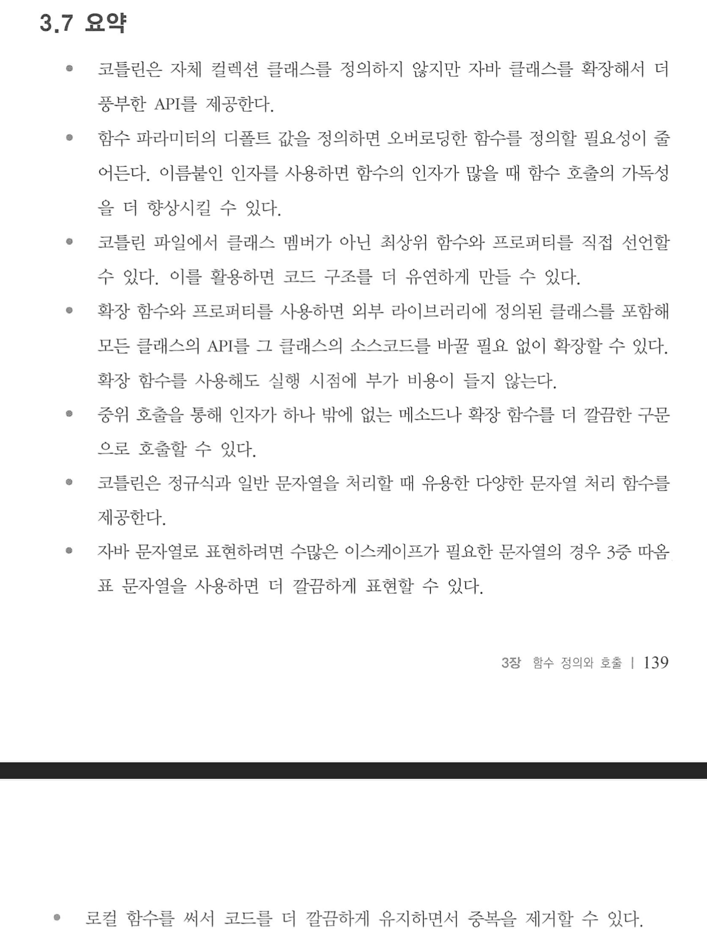

# 3장. 함수 정의와 호출

## 3.1 코틀린에서 컬렉션 만들기

```kotlin
// 함수를 사용해 집합 만들기
val set = hashSetOf(1, 7, 53)

// 리스트와 맵 만들기
val list = arrayListOf(1, 7, 53)
val map = hashMapOf(1 to "one", 7 to "seven", 53 to "fifty-three")
```

- map에서 to는 키워드가 아닌 일반 함수다.
- 코틀린은 자신만의 컬렉션 기능을 제공하지 않는다.
    - 이유는 표준 자바 컬렉션을 활용하면 자바 코드와 상호작용하기가 훨씬 쉽다.
    - 자바에서 코틀린 함수를 호출하거나 코틀린에서 자바 함수를 호출할 때 자바와 코틀린 컬렉션을 서로 변환할 필요가 없다.

## 3.2 함수를 호출하기 쉽게 만들기

- 자바 컬렉션에는 디폴트 toString 구현이 들어있다. 디폴트 구현과 달리 (1; 2; 3)처럼 원소 사이를 세미콜론으로 구분하고 괄호로 리스트를 둘러 싸고 싶다면?
- 코틀린으로 직접 함수를 구현해보자

```kotlin
// 리스트 3.1 
fun <T> joinToString(
    collection: Collection<T>,
    separator: String,
    prefix: String,
    postfix: String
): String {
    val result = StringBuilder(prefix)
    for ((index, element) in collection.withIndex()) {
        if (index > 0) result.append(separator)
        result.append(element)
    }
    result.append(postfix)
    return result.toString()
}

val list = listOf(1, 2, 3)
println(joinToString(list, "; ", "(", ")"))

// 결과 (1; 2; 3)
```

- 어떻게 하면 이 함수를 호출하는 문장을 덜 번잡하게 만들 수 있을까?
- 함수를 호출할 때마다 매번 네 인자를 모두 전달하지 않을 수는 없을까?

### 3.2.1 이름 붙인 인자

````kotlin
joinToString(collection, separator = "", prefix = " ", postfix = ".")
// 위 예제코드를 변환하면 아래와 같다.
println(joinToString(list, separator = "; ", prefix = "(", postfix = ")"))
````



- 코틀린으로 작성한 함수를 호출할 떄는 함수에 전달하는 인자 중 일부(또는 전부)의 이름을 명시할 수 있다.

### 3.2.2 디폴트 파라미터 값

- 자바에서는 일부 클래스에서 오버로딩한 메소드가 너무 많아진다는 문제가 있다.
- 코틀린에서는 함수 선언에서 파라미터의 디폴트 값을 지정할 수 있으므로 이런 오버로딩 중 상당수를 피할 수 있다.
- 디폴트 값을 사용해 joinToString 함수를 개선해보자.

```kotlin
fun <T> joinToString(
    collection: Collection<T>,
    separator: String = ", ",
    prefix: String = "",
    postfix: String = "",
): String
```

- 함수의 디폴트 파라미터 값은 함수를 호출하는 쪽이 아니라 함수 선언 쪽에서 지정된다는 사실을 기억하라.

| 디폴트 값과 자바

- 자바에서는 디폴트 파라미터 값이라는 개념이 없어서 코틀린 함수를 자바엣 ㅓ호출하는 경우에는 그 코틀린 함수가 디폴트 파라미터 값을 제공하더라도모든 인자를 명시해야 한다.
- 자바에서 코틀린 함수를 자주 호출해야 한다면 `@JvmOverloads` 애노테이션을 함수에 추가할 수 있다.
- 해당 애노테이션을 추가하면 코틀린 컴파일러가 자동으로 맨 마지막 파라미터로부터 파마미터를 하나씩 생략한 오버로딩한 자바 메소드를 추가해준다.
  

### 3.2.3 정적인 유틸리티 클래스 없애기: 최상위 함수와 프로퍼티

- 객체 지향 언어인 자바에서는 모든 코드를 클래스의 메소드로 작성해야 한다는 사실을 알고 있다.
- 하지만 실전에서는 어느한 클래스에 포함시키기 어려운 코드가 많이 생긴다.
- 코틀린에서는 이런 무의미한 클래스가 필요없다.
- 대신 함수를 직접 소스파일의 최상위 수준, 모든 다른 클래스의 밖에 위치시키면 된다.
- 최상위 함수만 포함되어있는 .kt 파일이 있을때 파일명으로 클래스를 생성한다.
- 코틀린파일을 자바로 변환하면 아래와 같다.

```java
package string;

public class JoinKt {
  public static String joinToString(...) {...}
}
```


**최상위 프로퍼티**

- 함수와 마찬가지로 프로퍼티도 파일의 최상위 수준에 놓을 수 있다.
- 어떤 데이터를 클래스의 밖에 위치시켜야 하는 경우는 흔하지는 않지만, 그래도 가끔 유용할 때가 있다.
- 예를들어
    - 어떤 연산을 수행한 횟수를 저장하는 var 프로퍼티
    - 정적 필드에 저장
- 기본적으로 최상위 프로퍼티도 다른 모든 프로퍼티처럼 접근자 메소드를 통해 자바 코드에 노출된다.
    - val의 경우 게터, var 의 경우 게터와 세터가 생긴다.
- 겉으론 상수처럼 보이는데, 실제로는 게터를 사용해야 한다면 자연스럽지 못하다. 더 자연스럽게 사용하려면 이 상수를 `public static final` 필드로 컴파일
  해야한다.
- `const` 변경자를 추가하면 프로퍼티를 `public static final` 필드로 컴파일하게 만들 수 있다.
    - 단 원시 타입과 String 타입의 프로퍼티만 const 로 지정할 수 있다.

```kotlin
const val UNIX_LINE_SEPARATOR = "\n"

public static final String UNIX_LINE_SEPARATOR = "\n"
```

## 3.3 메소드를 다른 클래스에 추가: 확장 함수와 확장 프로퍼티

- 기존 자바 API를 재 작성하지 않고도 코틀린이 제공하는 여러 편리한 기능을 사용할 수 있다면 정말 좋은 일 아닐까?
- 바로 `확장 함수` 가 그런 역할을 해줄 수 있다.
- 확장 함수는 어떤 클래스의 멤버 메소드인 것처럼 호출할 수 있지만 그 클래스의 밖에 선언된 함수다.

```kotlin
package strings

fun String.lastChar(): Char = this.get(this.length - 1)
```

- 확장 함수를 만들려면 추가하려는 함수 이름 앞에 그 함수가 확장할 클래스의 이름을 덧붙이기만 하면 된다.

```kotlin
package com.kurly.member.core.member.adult

import com.kurly.member.core.member.domain.Adult

fun AdultMemberJpaEntity.toDomain(): Adult {
    return Adult(
        isAdult = this.adult, verifiedAt = this.verifiedAt, expiredAt = this.expiredAt
    )
}
```



- 일반 메소드의 본문에서 this를 사용할 때와 마찬가지로 확장 함수 본문에도 this를 쓸 수 있다.
- 그리고 일반 메소드와 마찬가지로 확장 함수 본문에서 this를 생략할 수도 있다. -> 하지만 써주는게 더 직관적으로 생각된다.
- 확장 함수 내부에서는 일반적인 인스턴스 메소드의 내부에서와 마찬가지로 수신 객체의 메소드나 프로퍼티를 바로 사용할 수 있다(굿)
- **하지만 확장 함수가 캡슐화를 깨지는 않는다는 사실을 기억하라**
- **클래스 안에서 정의한 메소드와 달리 확장 함수 안에서는 클래스 내부에서만 사용할 수 있는 비공개(private) 멤버나 보호된(protected)멤버를 사용할 수 없다.**
  -> 접근제어자 private, protected 함수는 호출 못하는구나

### 3.3.1 임포트와 확장 함수

- 확장 함수를 사용하기 위해서는 그 함수를 다른 클래스나 함수와 마찬가지로 **임포트** 해야한다.
- 확장 함수를 정의하자마자 어디서는 그 함수를 쓸 수 있다면 한 클래스에 같은 이름의 확장 함수가 둘 이상 있어서 이름이 충돌하는 경우가 자주 생길 수 있다.

```kotlin
import strings.lastChar // or import strings.*

val c = "Kotlin".lastChar()
```

- as 키워드를 사용하면 임포트한 클래스나 함수를 다른 이름으로 부를 수 있다.

```kotlin
import strings.lastChar as last
```

### 3.3.2 자바에서 확장 함수 호출

- 내부적으로 확장 함수는 수신객체를 첫 번째 인자로 받는 정적 메소드다.
- **확장 함수를 호출해도 다른 어댑터 객체나 실행 시점 부가 비용이 들지 않는다.**
- 이런 설계로 인해 자바에서 확장 함수를 사용하기도 편하다. 단지 정적 메소드를 호출하면서 첫 번째 인자로 수신 객체를 넘기기만 하면 된다.

```java
char c=StringUtilKt.lastChar("Java");
```

### 3.3.3 확장 함수로 유틸리티 함수 정의

```kotlin
// joinToString()를 확장으로 정의하기
fun <T> Collection<T>.joinToString(
    separator: String = ", ", // 파라미터의 디폴트 값 지정
    prefix: String = "",
    postfix: String = ""
): String {
    val result = StringBuilder(prefix)
    for ((index, element) in this.withIndex())
        if (index > 0) result.append(separator)
    result.append(element)
    result.append(postfix)
    return result.toString()
}

val list = listOf(1, 2, 3)
println(list.joinToString(separator = "; ", prefix = "(", postfix = ")"))
// 결과 (1; 2; 3) 
```

- 확장 함수는 단지 정적 메소드 호출에 대한 문법적인 편의일 뿐이다.
- 그래서 클래스가 아닌 더 구체적인 타입을 수신 객체 타입으로 지정할 수도 있다.
- 그래서 문자열의 컬렉션에 대해서만 호출할 수 있는 join 함수를 정의하고 싶다면 다음과 같이 하면 된다.

```kotlin
fun Collection<String>.join(
    separator: String = ", ",
    prefix: String = "",
    postfix: String = ""
) = joinToString(separator, prefix, postfix)
println(listOf("one", "two", "eight").join(" "))
// 결과 one two eight
```

### 3.3.4 확장 함수는 오버라이드할 수 없다.

- 확장 함수는 클래스의 일부가 아니다.
- **확장 함수는 클래스 밖에 선언된다.**
- 이름과 파라미터가 완전히 같은 확장 함수를 기반 클래스와 하위 클래스에 대해 정의해도 실제로는 확장 함수를 호출할 때 수신 객체로 지정한 변수의 정적타입에 의해 어떤 확장
  함수가 호출될지 결정되지, 그 변수에 저장된 객체의 동적인 타입에 의해 확장 함수가 결정되지 않는다.
  
- 코틀린은 호출될 확장 함수를 정적으로 결정하기 때문이다.
- 어떤 클래스를 확장한 함수와 그 클래스의 멤버 함수의 이름과 시그니처가 같다면 확장 함수가 아니라 멤버 함수가 호출된다 -> **멤버 함수의 우선순위가 더 높다**

### 3.3.5 확장 프로퍼티

- 확장 프로퍼티를 사용하면 기존 클래스 객체에 대한 프로퍼티 형식의 구문으로 사용할 수 있는 API를 추가할 수 있다.
- 프로퍼티라는 이름으로 불리기는 하지만 상태를 저장할 적절한 방법이 없기 때문에 실제로 확장 프로퍼티는 아무 상태도 가질 수 없다.

```kotlin
/*
String 의 lastChar 확장함수 
package strings

fun String.lastChar(): Char = this.get(this.length - 1)
*/

val String.lastChar: Char get() = get(length - 1)
```



- 확장 함수의 경우와 마찬가지로 확장 프로퍼티도 일반적인 프로퍼티와 같은데, 단지 **수신객체 클래스가 추가됐을뿐이다**

```kotlin
var StringBuilder.lastChar: Char
    get() = get(length - 1)
    set(value: Char) {
        this.setCharAt(length - 1, value)
    }

val stringBuilder = StringBuilder("kotlin?")
stringBuilder.lastChar = '!'

println(stringBuilder)
//결과 : kotlin!
```

- 자바에서 확장 프로퍼티를 사용하고 싶다면 항상 StringUtilKt.getLastChar("Java) 처럼 게터나 세터를 명시적으로 호출해야한다.

## 3.4 컬렉션 처리 : 가변 길이 인자, 중위 함수 호출, 라이브러리 지원

- `vararg` 키워드를 사용하면 호출 시 인자 개수가 달라질 수 있는 함수를 정의할 수 있다.
- 중위 함수 호출 구문을 사용하면 인자가 하나뿐인 메소드를 간편하게 호출할 수 있다.
- 구조 분해 선언을 사용하면 복합적인 값을 분해해서 여러 변수에 나눠 담을 수 있다.

### 3.4.1 자바 컬렉션 API 확장

```kotlin
val strings: List<String> = listOf("first", "second", "fourteenth")
strings.last()
// fourteenth

val numbers = Collection<Int> = setOf(1, 14, 2)
numbers.max()
// 14
```

- 어떻게 자바 라이브러리 클래스의 인스턴스인 컬렉션에 대해 코틀린이 새로운 기능을 추가할 수 있을까?
    - last와 max는 모두 확장함수 였던것이다!

### 3.4.2 가변 인자 함수: 인자 개수가 달라질 수 있는 함수 정의

- 가변 길이 인자는 메소드를 호출할 때 원하는 개수만큼 값을 인자로 넘기면 자바 컴파일러가 배열에 그 값들을 넣어주는 기능이다.(varargs)
- 코틀린의 가변 길이 인자도 자바와 비슷하다.
- 타입 뒤에 ...를 붙이는 대신 코틀린에서는 파라미터 앞에 `vararg` 변경자를 붙인다.

```kotlin
fun main(args: Array<String>) {
    val list = listOf("args:", *args) // 스프레드 연산자가 배열의 내용을 펼쳐준다.
    println(list)
}
```

- 위 예제는 스프레드 연산자를 통하면 배열에 들어있는 값과 다른 여러 값을 함께 써서 함수를 호출할 수 **있음** 을 보여준다.
    - 이러한 기능은 자바에서는 사용할 수 없다.

### 3.4.3 값의 쌍 다루기: 중위 호출과 구조 분해 선언

```kotlin
val map = mapOf(1 to "one", 7 to "seven", 53 to "fifty-three")
```

- 여기서 to 라는 단어는 코틀린 키워드가 아니다.
- 이 코드는 중위호출 이라는 특별한 방식으로 to라는 일반 메소드를 호출한 것이다.
- 중위 호출 시에는 수신 객체와 유일한 메소드 인자 사이에 메소드 이름을 넣는다
    - 이때 객체, 메소드 이름, 유일한 인자 사이에는 공백이 들어가야 한다.

```kotlin
1.to("one")// to 메소드를 일반적인 방식으로 호출함
1 to "one"  //to 메소드를 중위 호출 방식으로 호출함
```

- 인자가 하나뿐인 일반 메소드나 인자가 하나뿐인 확장 함수에 중위 호출을 사용할 수 있다.
- 함수를 중위호출에 사용하게 허용하고 싶으면 `infix` 변경자를 함수 선언 앞에 추가해야한다

```kotlin
infix fun Any.to(other: Any) = Pair(this, other)
```

## 3.5 문자열과 정규식 다루기

### 3.5.1 문자열 나누기

- 코틀린 정규식 문법은 자바와 똑같다.
- 코틀린에서는 자바의 `split` 대신에 여러 가지 다른 조합의 파라미터를 받는 `split`확장 함수를 제공함으로써 혼동을 야기하는 메소드를 감춘다.

```kotlin
println("12.345-6.A".split("\\.|-".toRegex()))
// [12, 345, 6, A]

println("12.345-6.A".split(",", "-"))// 여러 구분 문자열을 지정한다.
// [12, 345, 6, A]
```

### 3.5.2 정규식과 3중 따옴표로 묶은 문자열

- 코틀린 표준 라이브러리에는 어떤 문자열에서 구분 문자열이 맨 나중(또는 처음)에 나타난 곳 뒤(또는 앞)의 부분 문자열을 반환하는 함수가 있다.

```kotlin
fun parsePath(path: String) {
    val regex = """(.+)/(.+)\.(.+)""".toRegex()
    val matchResult = regex.matchEntire(path)
    if (matchResult != null) {
        val (directory, filename, extension) = matchResult.destructured
        println("Dir: $directory, name: $filename, ext: $extension")
    }
}

parsePath("/Users/yole/kotlin-book/chapter.adoc")
// Dir: /Users/yole/kotlin-book, name: chapter.ad, ext: c
```

- 3중 따옴표 문자열에서는 **역슬래시(\)를 포함한 어떤 문자도 이스케이프할 필요가 없다.**
  

### 3.5.3 여러 줄 3중 따옴표 문자열

- 3중 따옴표 문자열을 문자열 이스케이프를 파히기 위해서만 사용하지 않는다.
- 3중 따옴표 문자열에는 줄 바꿈을 표현하는 아무 문자열이나(이스케이프 없이) 그대로 들어간다.

```kotlin
val kotlinLogo = """| //
                   .|//
                   .|/\
"""
println(kotlinLogo.trimMargin("."))
```

- 여러 줄 문자열에는 들여쓰기나 줄 바꿈을 포함한 모든 문자가 들어간다.
- 여러 줄 문자열을 코드에서 더 보기 좋게 표현하고 싶다면?
    - 들여쓰기를 하되 들여쓰기의 끝 부분을 특별한 문자열로 표시하고, `trimMargin`을 사용해 그 문자열과 그 직전의 공백을 제거한다.
    - 위 예제에서는 마침표를 들여쓰기 구분 문자열로 사용했다 (들여쓰기(\t) 들여쓰기(\t)) .)
- 여러 줄 문자열에는 줄 바꿈이 들어가지만 줄 바꿈을 \n 과 같은 특수 문자를 사용해 넣을 수는 없다.
- 반면에 \ 를 문자열에 넣고 싶으면 이스케이프할 필요가 없다.
- 따라서 일반 문자열로 ""C:\\Users\\yole\\kotlin一book"이라고 쓴 윈도우 파일 경로를 3중 따옴표 문자열로 쓰면 """C:
  \Users\yole\kotlin\book""" 이다.

- 3중 따옴표 문자열 안에 문자열 템플릿을 사용할 수도 있다.
- 3중 따옴표 문자열 안에 $를 넣어야한다면?
    - val price = """${'s'}99.9"""

## 3.6 코드 다듬기: 로컬 함수와 확장

- 자바의 경우 메소드 추출, 리팩토링을 적용해서 긴 메소드를 부분부분 나눠 재활용 할수 있다.
- 하지만 리팩토링하면서 클래스 안에 작은 메소드가 많아지고 각 메소드 사이의 관계를 파악하기 힘들어서 코드를 이해하기 더 어려워질 수도 있다.
- 리팩토링을 진행해서 추출한 메소드를 별도의 내부 클래스 안에 넣으면 코드를 깔끔하게 조직할 수는 있지만, 그에따른 불필요한 준비코드가 늘어난다.
- **코틀린에서는 함수에서 추출한 함수를 원 함수내부에 중첩시킬 수 있다.**

```kotlin
// 리스트 3.11 코드 중복을 보여주는 예제
class User(val id: Int, val name: String, val address: String)

fun saveUser(user: User) {
    if (user.name.isEmpty()) {
        throw IllegalArgumentException(
            "Can't save user ${user.id}: empty Name"
        )
    }
    if (user.address.isEmpty()) {
        throw IllegalArgumentException(
            "Can't save user ${user.id}: empty Address"
        )
    }
    // user 를 데이터베이스에 저장한다.
}
saveUser(User(1, "", ""))
//결과 : java. lang. IIIegalArgumentExceptl○n : Can 't save user 1 : empty Name
```

- 이런 경우 검증 코드를 로컬 함수로 분리하면 중복을 없애는 동시에 코드 구조를 깔끔하게 유지할 수 있다.

```kotlin
// 로컬 함수를 사용해 코드 중복 줄이기
class User(val id: Int, val name: String, val address: String)

fun saveUser(user: User) {
    fun validate(user: User, value: String, fieldName: String)
    if (value.isEmpty()) {
        throw IllegalArgumentException(
            "Can't save user ${user.id}: empty $fieldName"
        )
    }
    validate(user, user.name, "Name") // 로컬 함수를 호출해서 각 필드를 검증한다.
    validate(user, user.address, "Address")
}

//로컬 함수에서 바깥 함수의 파라미터 접근하기
class User(val id: Int, val name: String, val address: String)

fun saveUser(user: User) {
    fun validate(value: String, fieldName: String) {// 이제 saveUser 함수의 user 파라미터를 중복 사용하지 않는다.
        if (value.isEmpty()) {
            throw IllegalArgumentException(
                "Can't save user ${user.id}: empty $fieldName"// 바깥 함수의 파라미터에 직접 접근할 수 있다.
            )
        }
    }
    validate(user.name, "Name")
    validate(user.address, "Address")
}
```

- 검증로직을 User 클래스를 확장한 함수로 만들 수도 있다.

```kotlin
class User(val id: Int, val name: String, val address: String)

fun User.validateBeforeSave() {
    fun validate(value: String, fieldName: String) {
        if (value.isEmpty()) {
            throw IllegalArgumentException(
                "Can't save user ${id}: empty $fieldName"// 바깥 함수의 파라미터에 직접 접근할 수 있다.
            )
        }
    }
  validate(name, "Name")
  validate(address, "Address")
}
fun saveUser(user: User){
    user.validateBeforeSave() // 확장함수를 호출한다.
  // user 를 데이터베이스에 저장한다.
}
```
- 코드를 확장 함수로 뽑아내는 기법은 놀랄만큼 유용하다.
- User 를 간결하게 유지하면 생각해야 할 내용이 줄어들어서 더 쉽게 코드를 파악할 수 있다.
- 확장 함수를 로컬 함수로 정의할 수도 있다. 
  - 즉 User.validateBeforeSave를 saveUser내부에 로컬 함수로 넣을 수 있다. 하지만 중첩된 함수의 깊이가 깊어지면 코드를 읽기가 상당히 어려워진다. 따라서 **일반적으로는 한 단계만 함수를 중첩시키라고 권장한다.**

## 3.7 요약



